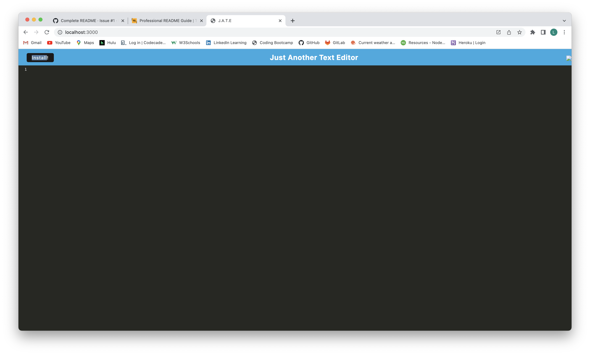
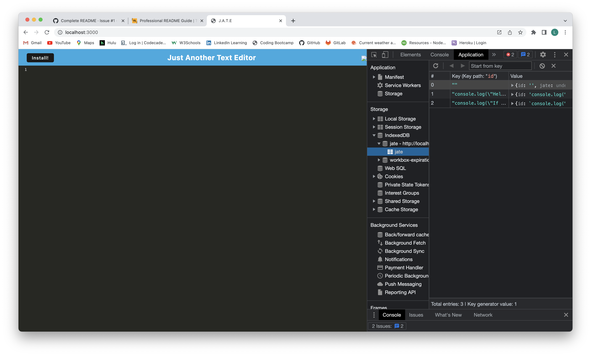
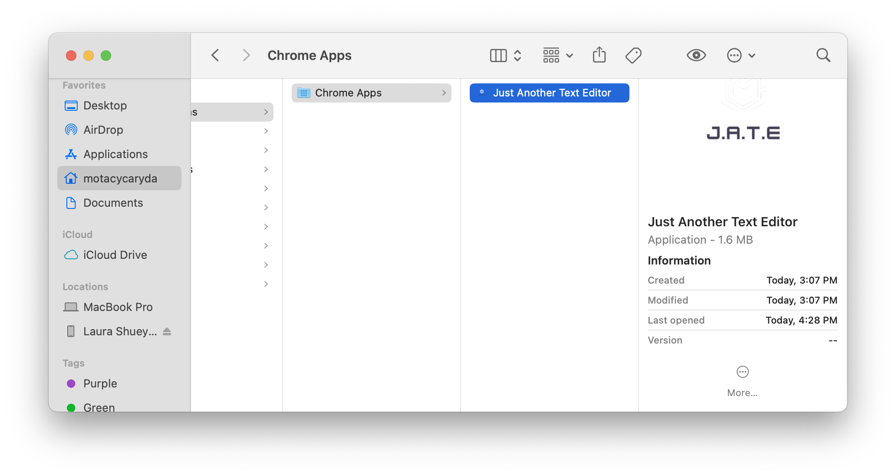
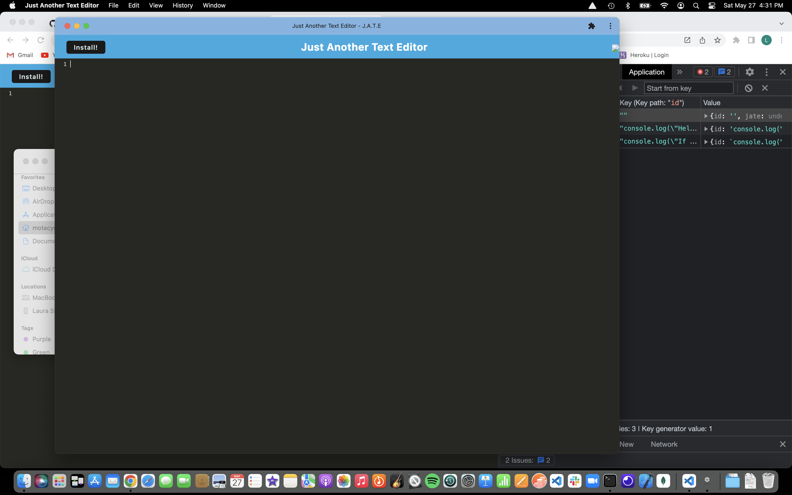

# editNOW

## Description

editNow is a Progressive Web Application that allows the user to use a web browser-based tool to write and edit code, and allows for the storage of these items in the indexedDB built into the browser.  The user is also able to install this application to their desktop, to allow them to continue working online and still be able to use the indexedDB to store their work.  This allows them to retrieve a project idea or note some code, even when they do not have access to the internet.  editNow provides a small, portable notebook that the user can use for writing quick notes and ideas in code, and be able to retrieve them for later use.

This challenge dived into a lot of things that pushed my knowledge and understanding.  Webpack, Service Workers, and Manifest Injection are all items that while I am now familiar with the names, I still have some work to do to become fluent with their actual use.  I am pleased that I was able to put a lot of the pieces together to have the application run.  And solving the errors that occurred on initial start was a good step toward understanding what was actually happening in this application.

## Table of Contents

-[Installation](#Installation)

-[Usage](#Usage)

-[Credits](#Credits)

-[License](#License)

-[Questions](#Questions)

## Installation

The application is deployed to Heroku, at the link below:

[editNow]()

## Usage

Open the Text Editor by navigating to the website.

Edit your text, hit the save icon in the upper right corner to save your text to the database.

To install the application, click on the install button in the top left.  Once the application installs it will open in its own window.

## Credits

I referred to the class exercises, read some posts on Stack Overflow and a couple other blogs to complete this challenge.  The starter code is ©2023 EdX Bootcamps.

## License

 
[MIT License](https://opensource.org/license/mit-0/)
 
For the complete text of the license, please click on the link provided.

## Questions

If you have questions, please reach out to me at:

[github profile](github.com/lhardywilcox)

 or

[email](motacycaryda@mac.com)
